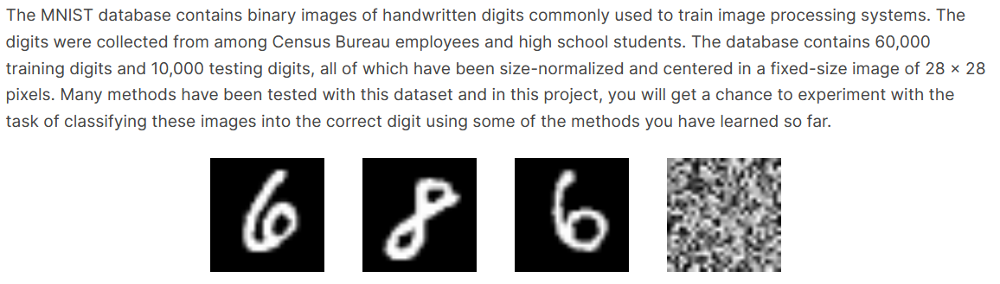
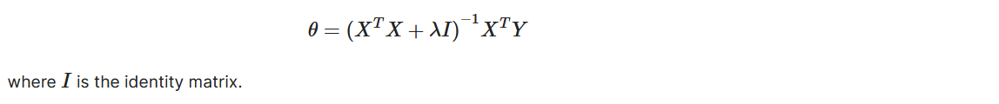
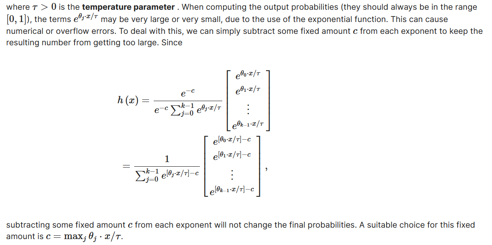
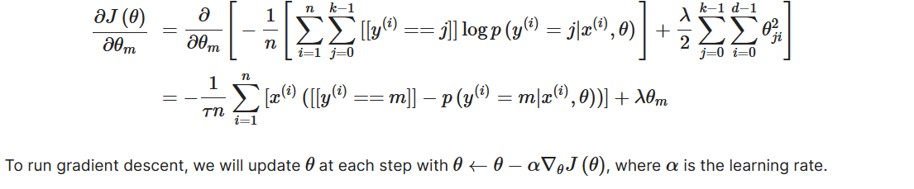
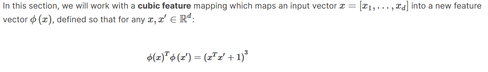
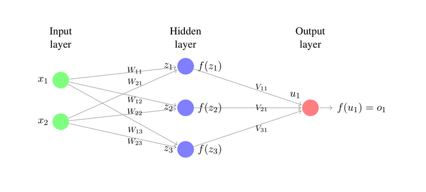
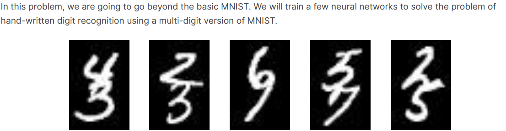

# Digit_Recognition
A machine learning project to recognize handwritten digits based on the MNIST dataset.This project is a part of a graduate course on Machine Learning from MIT offered on edx (MIT 6.86x: Machine Learning with python: From Linear Models to Deep Learning).

## Dataset

## Part 1

This folder contains the custom implementation of regression, support vector machines, softmax, kernels and PCA. It contains functions created to code the following mathematical representations of the algorithms and compare the accuracy of each.The files in this folder are:
<ul>
  <li>linear_regression.py: implemented in closed form using a regularizing parameter(test error: 0.77 with lambda = 0.01)</li>
  
  
  <li>SVM.py: implemented multiclass svm classification(test error: 0.08 with c=0.1)</li>
  
  <li> softmax.py: custom implementation of softmax (test error = 0.08 with temp_parameter =0.5) with the following representation</li>
  
  
  
  
  <li>kernel.py : implements kernel in the following way</li>
  
  
  <li>features.py: implements PCA (test error = 0.08 for 10 dimensional PCA reduction) and cubic feature transformation </li>
  
  <li>test.py: contains test data for testing functions</li>
 </ul>
  
## Part2-nn

This folder contains the python files for implementaion of neural networks.

<ul>
  <li>neural_nets.py: implements a simple feed forward neural network from scratch and trains it with custom built functions </li>
  
  
 </ul>
 
 ## Part2-mnist
This folder contains files for implementing CNN and MLP neural networks.
<ul>
  <li>nnet_fc.py : A simple fully connected neural network with one hidden layer with 10 units (test accuracy = 0.92) </li>
  <li>nnet_cnn.py : A simple implementation of a CNN</li>
  <li>trainutils.py : A utility functional file</li>
 </ul>
 
 ## Part2-twodigits
 This folder contains the files to recognize two digits that are slightly overlapped with each other.
 
 <ul>
  <li>mlp.py: implements multilayer perceptron to recognize the two digits </li>
  
  <li>conv.py: implements CNN network to recognize the two digits(test accuracy = 0.98)</li>
 </ul>
 

  
